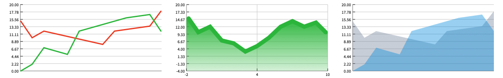
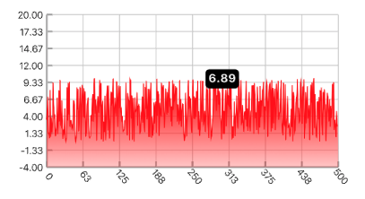
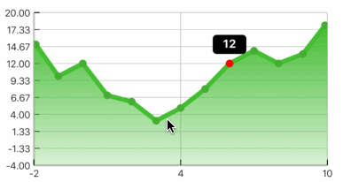
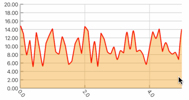
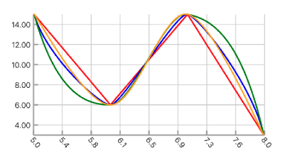

# react-native-responsive-linechart

   

## Announcing v5

Breaking changes with respect to v4:

- New dependency on `react-native-gesture-handler` 

Breaking changes with respect to v3:

- Support for data point visualizations
- Library supplied tooltip component is renamed from `BoxTooltip` to just `Tooltip`
- Minor theme changes (box -> shape rename)

Additional features:
- Scrollable charts!

## [View installation docs & examples here](https://react-native-responsive-linechart.surge.sh)

### Screenshots







### Quick example

```javascript
import { Chart, VerticalAxis, HorizontalAxis, Line } from 'react-native-responsive-linechart'

<Chart
  style={{ height: 200, width: '100%', backgroundColor: '#eee' }}
  xDomain={{ min: -2, max: 10 }}
  yDomain={{ min: -2, max: 20 }}
  padding={{ left: 20, top: 10, bottom: 10, right: 10 }}
>
  <VerticalAxis tickValues={[0, 4, 8, 12, 16, 20]} />
  <HorizontalAxis tickCount={3} />
  <Line data={data1} smoothing="none" theme={{ stroke: { color: 'red', width: 1 } }} />
  <Line data={data2} smoothing="cubic-spline" theme={{ stroke: { color: 'blue', width: 1 } }} />
</Chart>

const data1 = [
  { x: -2, y: 1 },
  { x: -1, y: 0 },
  { x: 8, y: 13 },
  { x: 9, y: 11.5 },
  { x: 10, y: 12 }
]

const data2 = [
  { x: -2, y: 15 },
  { x: -1, y: 10 },
  { x: 0, y: 12 },
  { x: 1, y: 7 },
  { x: 8, y: 12 },
  { x: 9, y: 13.5 },
  { x: 10, y: 18 }
]
```


## [OLD] Announcing v3

Version 3 is a complete re-write from the ground up with the following exciting features:

- Completely written in Typescript
- Composable API, every part of the chart is its own component.
- Very few dependencies (Total package size is only 62 kilobytes)
- New documentation website with extensive examples
- Support for smooth/linear line & charts area charts, tooltips and more

Due to the nature of the changes, version 2.2 and below is now no longer supported. You can find the [old README here](https://github.com/N1ghtly/react-native-responsive-linechart/blob/master/README-v2.2.md).
